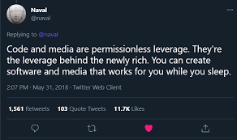

# Who am I

## 👋 Hello there! I'm Dhruv Kulkarni

- **Location:** Surat, India
- **Email:** dhruvkulkarni22@gmail.com

### About me:

- 🎓 Bachelor of Technology at SVNIT, Surat
- 🧠 Passionate Computer Enthusiast, interested in Computer Architecture for Machine Learning Algorithms.
- 📚 Interested in Pursuing Higher Education
- 🎓 High School: Cambridge College of Arts, Science and Commerce, Pune - Grade obtained: 93.33%
- 🏫 Secondary School: Podar International School, Pimpri, Pune - Grade obtained: 95.8%
- 🗓️ Expected Graduation: Dec, 2021 - 2025

# My Philosophy

  

  

# My TechStack

<h3 align="left">Languages and Tools:</h3>

  
  
  
  
  
  
  
  
  
  
  

Let's connect and explore the world of technology together! 🚀
